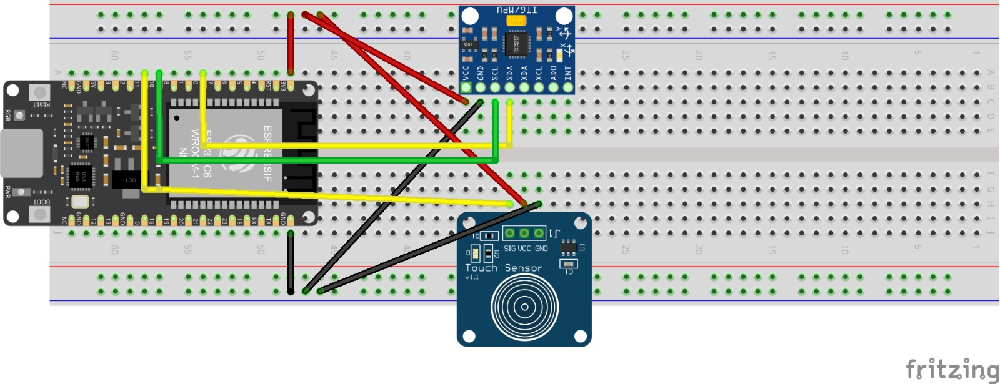

## Kurzbeschreibung des Projekts

* **Modul:** Interaktive Medien 4 an der Fachhochschule Graubünden (FS26)  
* **Themenfeld:** IoT-Applikation zum Thema Eltern mit kleinen Kindern  
* **Name des Projekts:** Eckzahn Eddy  
* **Team Physical Computing:** Marina Lampert, Laura Seger  
* **Team WebApp:** Max Hutmacher, Saskia Lerf
 
Eckzahn Eddy soll ein Produkt bzw. eine Webapp rund ums Zähneputzen sein in Kombination mit einer Zahnbürste, die über ein Touch- und Lagessensor verfügt. Ziel ist es, Kinder spielerisch dazu zu motivieren, ihre Zähne besser und regelmässiger zu putzen.

### UX & Konzeption

*In diesem Teil werden die gemeinsamen Schritte aus der UX-Abgabe dokumentiert, damit sich hier alles vollständig an einem Ort befindet (betrifft WebApp und Physical Computing)*

* **Figma:** (https://www.figma.com/design/7dYuJ7zHd2DgF7CtyG6XbB/im4-eckzahn-eddy?m=auto&t=oUmAeBcnwc444ZSt-1)
* **User Flow \+ Screen Flow** (Screenshot aus Figma)  
* ggf. weitere Ergänzungen
* *Welche Features waren angedacht?*
* *Welche Features wurden nicht umgesetzt? (Warum)*

### Setup

* **WebApp:** (https://eckzahneddy.marina-lampert.ch/login.html)  
* **Video-Dokumentation:** [Link zum Video auf Youtube](http://link.zum.video) 

#### Installationsanleitung WebApp

***verständliche** Schritt-für-Schritt-Anleitung für Aussenstehende, um das Projekt zu klonen und auf einem eigenen Server zu installieren*

1. *Was benötige ich an Infrastruktur?*  
2. *Was muss ich auf meinem Webserver installieren?*  
3. *Wie kann ich die Datenbank importieren?*  
4. *Wo muss ich die DB-Credentials eintragen?*  
5. *…*  
6. *Wie nehme ich das physische Artefakt in Betrieb?*

#### Bauanleitung Physical Computing

* ***Was muss ich wie bauen, verbinden, installieren?***  
* *ergänze: **Komponentenplan** (betrifft Physical Computing, vgl. Slides Kapitel 15): Schaubild enthält*  
  * *die eingesetzten Komponenten*  
  * *die verbundenen Sensoren und Aktoren*  
  * *die Programme (mit Dateinamen)*  
  * *die Kommunikationswege*  
* **Steckplan**

## technische Details

// Hier sollte das Verständnis ersichtlich sein / Wie stehen die Dateien in Beziehung zueinander, Wie reden Die Dateien miteinander, Wie ist der Weg der Daten

* **Projektstruktur / Code-Struktur:** \[*Hinweis: Der Code selbst muss im Repository liegen und im Kopfbereich jeder Datei eine kurze Zusammenfassung enthalten.*\]  
* **Datenschnittstelle: \[***zwischen WebApp und Physical Computing*\]  
* **ERM:** 

Im Mittelpunkt des Systems stehen die Entitäten User*innen, Familien, Kinder, Sensordaten und Events. Eine Userin repräsentiert eine Benutzerin der App, beispielsweise ein Elternteil oder eine erziehungsberechtigte Person. Zu jeder Userin werden Informationen wie Name, E-Mail-Adresse und Passwort gespeichert. Ausserdem ist jede Userin genau einer Familie zugeordnet. Eine Familie kann dabei mehrere User*innen besitzen.

Die Entität „Familie“ dient dazu, mehrere Kinder und User*innen organisatorisch zusammenzufassen. Zu jeder Familie werden eine eindeutige ID sowie der Familienname gespeichert. Einer Familie können mehrere Kinder zugeordnet werden, während jedes Kind immer nur zu einer Familie gehört.

Die Entität „Kinder“ enthält die Daten der Kinder, deren Zahnputzverhalten überwacht wird. Für jedes Kind werden eine eindeutige ID, der Name sowie die Zugehörigkeit zur Familie gespeichert. Die Kinder stehen im direkten Zusammenhang mit den von der Zahnbürste erfassten Sensordaten und Ereignissen.

Die intelligenten Zahnbürsten senden kontinuierlich Sensordaten an die App. Diese werden in der Entität „Sensordaten“ gespeichert. Dazu gehören beispielsweise Zeitstempel, Aktivitätswerte sowie Informationen des Lage- oder Touchsensors. Jedes Kind kann dabei viele Sensordatensätze besitzen, während jeder einzelne Datensatz genau einem Kind zugeordnet ist. Dadurch lässt sich nachvollziehen, wie lange und wie häufig ein Kind seine Zähne putzt.

Zusätzlich werden besondere Ereignisse in der Entität „Events“ gespeichert. Dazu zählen beispielsweise der Start oder das Ende eines Putzvorgangs oder andere relevante Aktionen der Zahnbürste. Zu jedem Event werden eine ID, ein Zeitstempel, die Art des Ereignisses sowie die Zuordnung zum entsprechenden Kind gespeichert. Auch hier gilt, dass ein Kind mehrere Events besitzen kann, ein Event jedoch immer nur zu einem Kind gehört.

* **Authentifizierung:** \[*Erklärung*\]

## Known bugs

* Was funktioniert noch nicht einwandfrei?
* Was ist uns aufgefallen bei der Entwicklung?  
* Was könnte noch verbessert werden?

## Umsetzungsprozess

* **Reflexion / Erfahrung / Lernfortschritt:** *Was haben wir gelernt? Würden wir es nochmal genauso machen? Was war gut, was war schlecht?*  
* **Herausforderungen & Lösungen:** \[*Verworfene Ansätze, Fehler, Umplanungen*\]  
* **KI-Einsatz:** *Dokumentation der verwendeten KI-Tools und deren Nutzen (KI ist nicht verboten)*  
* **Fazit:** …
